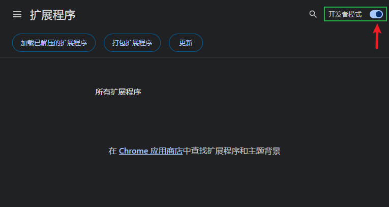
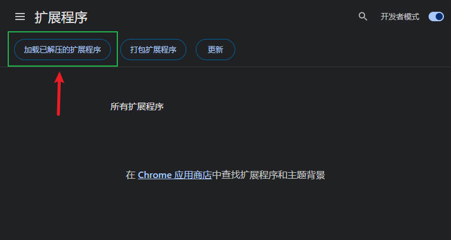
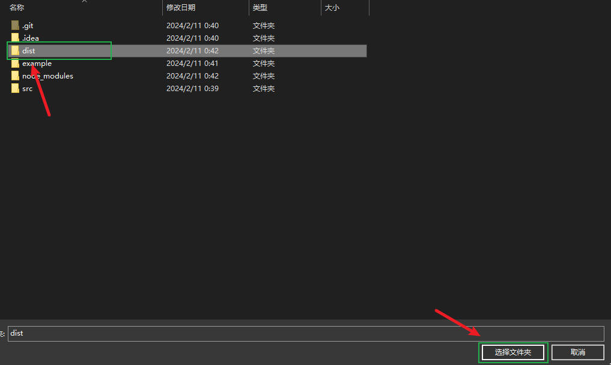

# chrome-extensions-template

> chrome extensions template

## Build

```bash
# build files to `/dist` directory
npm install
npm run build
```

## 加载插件到浏览器

1. 打开浏览器拓展程序开发者模式
2. 选择"加载已解压的扩展程序"
3. 选择"/dist"文件夹




