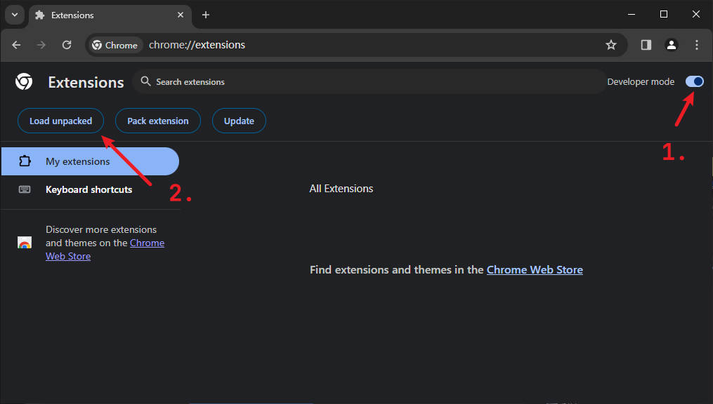
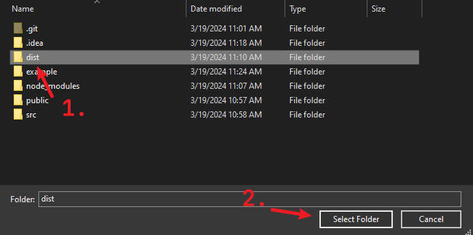
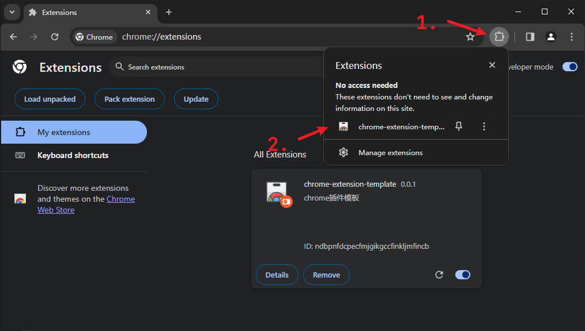
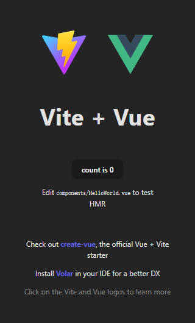

# chrome-extensions-template

> chrome extensions template
> > vite vue typescript scss

## Build

```bash
git clone https://github.com/afute/chrome-extension-template

cd chrome-extension-template

npm install

npm run build
```

## Load to browser





